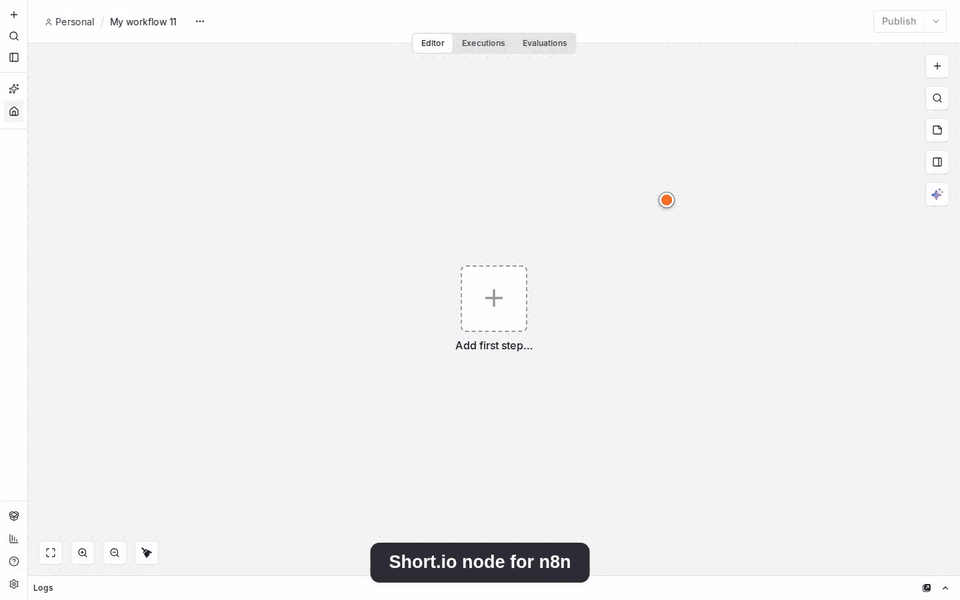

# n8n-nodes-shortio

[](LICENSE)

An n8n community node for [Short.io](https://short.io), a branded short-link service. It covers
Short.io's server-side API: links, bulk link operations, QR codes, OpenGraph, link permissions,
country/region targeting, folders, domains, statistics, and a polling trigger for new links and
clicks.

> This package is unofficial. It is not affiliated with, endorsed by, or supported by Short.io.
> "Short.io" is used only to describe what the node connects to.

> **Status:** Unofficial community node; see [Excluded](#excluded) for API features that are
> not covered, and [Version history](#version-history) for releases.

## Demo



[Watch the full demo video (MP4)](assets/demo/shortio-demo.mp4)

- [Demo](#demo)
- [Installation](#installation)
- [Credentials](#credentials)
- [Operations](#operations)
- [Trigger](#trigger)
- [Bulk operations](#bulk-operations)
- [Rate limits](#rate-limits)
- [Statistics notes](#statistics-notes)
- [Excluded](#excluded)
- [Compatibility](#compatibility)
- [Usage terms](#usage-terms)
- [Resources](#resources)
- [Version history](#version-history)

## Installation

On a self-hosted n8n instance:

1. Go to **Settings → Community Nodes**.
2. Select **Install**, enter `@t0mer/n8n-nodes-shortio`, and confirm.

See the n8n guide to
[installing community nodes](https://docs.n8n.io/integrations/community-nodes/installation-and-management)
for other options, including manual installation with npm in a queue-mode or self-hosted setup:

```bash
npm install @t0mer/n8n-nodes-shortio
```

## Credentials

The node authenticates with a Short.io **secret** API key. Public keys (the kind used in
client-side JavaScript) are not supported — every operation runs server-side.

1. In the Short.io dashboard, go to **Integrations & API** and create a secret key. See
   [Creating an API key](https://developers.short.io/docs/creating-an-api-key) for the walkthrough.
2. In n8n, create a **Short.io API** credential and paste the key into **Secret API Key**.

The key's team or domain permissions limit which domains the node can see and act on — a key
scoped to one domain won't list or resolve others. The credential test calls
`GET /api/domains`.

## Operations

**Domain**, **Link** and **Folder** fields use a resource locator:

- **Domain** — **From List** (fetched via `GET /api/domains`, shown by hostname) or **By ID**.
- **Link** — **By ID** (accepts both the current `link_…` and the older `lnk_…` idString format)
  or **By Short URL**, which accepts a full short link (`https://host/path`) and resolves it
  through `GET /links/expand`.
- **Folder** — **From List** (`GET /links/folders/{domainId}`) or **By ID**.

### Link

| Operation | Notes |
|---|---|
| Archive | |
| Archive Many | Up to 150 links per call |
| Create | Domain and Original URL required; every other field is optional |
| Create Many | Up to 1000 links per call, paced at 5 calls / 10 s. Requests are grouped by domain and folder first, since a single call can only carry one domain and one folder. If a call fails without Continue On Fail, the error reports how many links were already created. |
| Delete | |
| Delete Many | Up to 150 links per call, paced at 1 call / s |
| Generate QR Code | Binary image output. The image bytes are returned directly by Short.io in the same request (no separate download, no third-party host); the MIME type and extension follow the Type option |
| Generate QR Codes (Many) | Up to 150 links per call; binary output, one ZIP per call, returned directly by Short.io the same way as Generate QR Code |
| Get | |
| Get by Original URL | Returns every link created for that URL |
| Get by Path | Looks up a link by its Domain and Path |
| Get Many | Paginated; supports date range, folder and sort-order filters |
| Tag Many | Appends one tag to up to 150 links per call |
| Unarchive | |
| Unarchive Many | Up to 150 links per call |
| Update | Same fields as Create, all optional, **except Folder and Allow Duplicates**, which Short.io's update endpoint doesn't accept |

### Link OpenGraph

| Operation | Notes |
|---|---|
| Get | |
| Set | |

### Link Permission

| Operation | Notes |
|---|---|
| Add | |
| Delete | |
| Get Many | |

### Link Country Targeting

| Operation | Notes |
|---|---|
| Create | Country is an ISO 3166-1 alpha-2 code |
| Create Many | Multiple countries for one link in a single call |
| Delete | |
| Get Many | |

### Link Region Targeting

| Operation | Notes |
|---|---|
| Create | Region is the bare subdivision code (e.g. `CA`, not `US-CA`) |
| Create Many | Multiple regions for one link in a single call |
| Delete | |
| Get Many | |
| Get Regions for Country | Populates the Region selector for the chosen country |

### Folder

| Operation | Notes |
|---|---|
| Create | |
| Get | |
| Get Many | |

### Domain

| Operation | Notes |
|---|---|
| Create | |
| Get | |
| Get Many | |
| Update Settings | Exposes every domain setting field as optional in Update Fields. A separate **Clear Fields** option explicitly nulls out the 7 nullable settings (AdRoll/Facebook/Google Analytics/Google Tag Manager Integration, Not Found Redirect, Segment Key, Webhook URL) instead of leaving them unchanged; the 404-redirect field is labeled **Not Found Redirect** |

### Statistic

| Operation | Notes |
|---|---|
| Get Domain Statistics | |
| Get Domain Statistics by Interval | |
| Get Domain Top Values | **Column** and **Limit** (default 50) — see [Statistics notes](#statistics-notes) for the column list |
| Get Link Clicks | Identify links by ID or by path; takes an optional date range only (no Period, Timezone or Filters). In Path mode, Created At is required per link, and the response is keyed by the bare path the node sends (not by what you enter) |
| Get Link Statistics | |
| Get Link Statistics by Interval | |
| Get Link Top Values | **Column** and **Limit** (default 50). Short.io's own endpoint for this doesn't work, so it's computed from Get Domain Top Values filtered to the link's path — one extra request, and no **Prefix** (it wouldn't mean anything once the query is already scoped to a single path) |
| Get Raw Clicks | Raw click log for a domain (most recent clicks; Short.io does not document the sort order); **Limit** defaults to 50 |

See [Statistics notes](#statistics-notes) for the shared Period, Timezone and Filters parameters.

## Trigger

**Short.io Trigger** is a polling trigger with two events:

- **New Link** — emits links created since the last poll. A link created with a backdated
  **Created At** earlier than the last poll's mark is not emitted, since the mark only ever moves
  forward.
- **New Click** — emits raw clicks recorded since the last poll, up to 2,000 clicks (20 pages of
  100) per poll; a burst larger than that is capped, with older clicks from the same burst skipped
  and a warning logged, rather than delaying the whole poll further.

On first activation, the trigger stores a high-water mark and emits nothing; later polls emit
only newer items. **Fetch Test Event** (manual mode) returns the most recent matching item as a
sample without changing the stored state.

## Bulk operations

| Operation | Chunk size | Pacing |
|---|---|---|
| Create Many | Up to 1000 links per call | 5 calls / 10 s |
| Archive Many / Unarchive Many / Delete Many / Generate QR Codes (Many) | Up to 150 links per call | 1 call / s. Delete Many's limit is documented; the other three hit undocumented 429s (Retry-After up to 24 s) in live testing and are paced the same way as a precaution |
| Tag Many¹ | Up to 150 links per call | No documented limit |

¹ Short.io documents no maximum for Tag Many; 150 per call is the node's own conservative batch
size, matching the sibling bulk endpoints.

All bulk operations take every input item and split it into chunks of the sizes above.
**Create Many** additionally groups items by domain hostname and folder before chunking, since a
single `POST /links/bulk` call can only carry one domain and one folder — a batch that mixes
folders or domains makes more calls than the chunk size alone implies.
**Create Many is not transactional**: a chunk can partly succeed. A failed link comes back as an
error item mapped to its original input index with continue-on-fail turned on; without
continue-on-fail, the node throws and lists the failing item indexes, and for Create Many the
error message also reports how many links were already created before the failure. **Generate QR
Codes (Many)** returns one ZIP file per chunk (not per link), so its output is one binary item per
chunk of up to 150 links.

## Rate limits

Short.io's documented per-endpoint limits:

| Endpoint(s) | Limit |
|---|---|
| Create a link | 50 requests / s |
| Get, Update, Delete, Expand a link | 20 requests / s |
| Create Many (bulk) | 5 requests / 10 s |
| Delete Many (bulk) | 1 request / s |

Other endpoints have no documented limit. On an HTTP 429 response, the node retries automatically
up to 3 attempts in total, honouring the `Retry-After` header when Short.io sends one.

## Statistics notes

- **Period** accepts `today`, `yesterday`, `total`, `week`, `month`, `lastmonth`, `last7`,
  `last30` (default) or `custom`. Choosing **Custom** exposes **Start Date** and **End Date**.
- **Timezone** is an IANA name (for example `Europe/Berlin`), sent as `tz`. Short.io's older
  `tzOffset` parameter is deprecated and is never sent. Dates are interpreted in the selected
  Timezone.
- **Filters** (where the operation supports them) are an include/exclude pair over columns such
  as country, browser, browser version, social network, HTTP status, path, protocol, method,
  referrer host, and UTM source/medium/campaign.
- **Column** (the Top Values operations) is one of 18 values: A/B Path, Browser, Browser Version,
  City, Country, Goal Completed, Human, Method, OS, Path, Path (404), Protocol, Referrer Host,
  Social, Status, UTM Campaign, UTM Medium, UTM Source.
- **Limit** on the Top Values operations and Get Raw Clicks defaults to 50, with no documented
  maximum.
- Get Raw Clicks' **After Date**/**Before Date** are pagination cursors, not a report window —
  they're ignored when **Period** is **All Time**; use **Period: Custom** (or another preset) to
  page through results.
- Charts (Get Domain/Link Statistics by Interval), the Top Values operations and Get Link Clicks
  count **human clicks only** by default; the plain click totals (`clicks`/`totalClicks` from Get
  Domain/Link Statistics) count all clicks, bots included.

## Excluded

These Short.io endpoints and features are intentionally not implemented:

| Item | Reason |
|---|---|
| `POST /links/public` | Public-key endpoint for client-side (browser/mobile) use only |
| `GET /links/tweetbot` | GET-based duplicate of Create that puts the secret key in the query string |
| `GET /links/by-original-url` | Deprecated; replaced by Get by Original URL (`GET /links/multiple-by-url`) |
| Legacy `*.short.cm` hosts and numeric link IDs | Superseded by `*.short.io` hosts and `lnk_…`/`link_…` idStrings |
| `GET /statistics/domain/{id}/paths` (Get Popular Links) | Deprecated; use **Get Domain Top Values** with **Column = Path** for the same data |
| Conversion tracking | Short.io sends conversions with a browser-only `navigator.sendBeacon()` call to your own branded domain — there is no secret-key API endpoint for it |
| Clear Domain Statistics (`DELETE /statistics/domain/{id}/statistics`) | Documented by Short.io but not available on the live API (returns 404 Route not found) |
| Get Domain Top Values by Interval (`POST /statistics/domain/{id}/top_by_interval`) | Documented by Short.io but not available on the live API (returns 404 Route not found) |

## Compatibility

Requires n8n 1.x or later with community nodes enabled. Built and tested with Node.js 24.

## Usage terms

Use of this node is subject to [Short.io's Terms of Service](https://short.io/terms) and the
limits of your Short.io plan. See the [Short.io API documentation](https://developers.short.io/)
for the full reference this node is built against.

## Resources

- [n8n community nodes documentation](https://docs.n8n.io/integrations/#community-nodes)
- [Short.io API documentation](https://developers.short.io/)
- [Short.io API key setup](https://developers.short.io/docs/creating-an-api-key)

## Version history

Versions follow `YYYY.M.PATCH`, set from the git tag at publish time.

- **2026.9.1** — No functional changes. First release published through npm Trusted
  Publishing (OIDC) instead of an access token.
- **2026.9.0** — Initial release: the Short.io node (Domain, Folder, Link, Link Country
  Targeting, Link OpenGraph, Link Permission, Link Region Targeting, Statistic) and the Short.io
  Trigger (New Link, New Click).

## License

[MIT](LICENSE)
